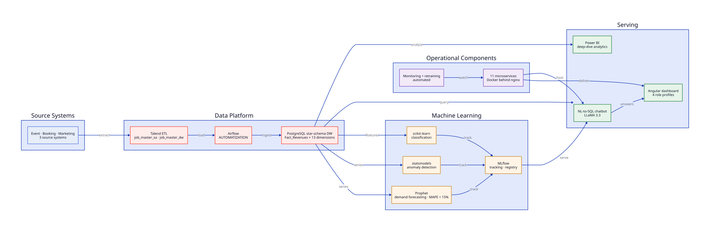
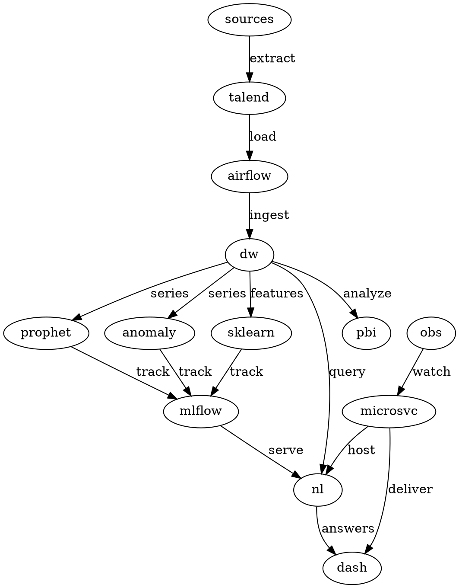

# EventZilla BI — Event Analytics Platform

**End-to-end event analytics platform** — star-schema warehouse, ETL, ML forecasting/anomaly detection, NL-to-SQL, and containerized microservices.

> Academic team project (6 people). My scope: integration, Docker/nginx delivery, and chatbot/API fixes.

---

## Architecture



*Source systems flow through Talend ETL and Airflow ingestion into a PostgreSQL
star-schema warehouse organized around business questions. MLflow-tracked models
serve a natural-language interface over 11 Dockerized microservices behind nginx.*

<details>
<summary><b>Diagram sources (D2 · Graphviz)</b></summary>

- [`docs/architecture.d2`](docs/architecture.d2) — render with `d2 docs/architecture.d2 docs/architecture.svg`
- [`docs/architecture.dot`](docs/architecture.dot) — render with `dot -Tsvg docs/architecture.dot -o docs/architecture-gv.svg`

```d2
direction: down

sources: "3 source systems\nevent · booking · marketing"
talend: "Talend ETL\ntransformations"
airflow: "Airflow\nreliable ingestion"
dw: "PostgreSQL star-schema DW\nbusiness questions, not source schemas"
prophet: "Prophet\ndemand forecasting\nMAPE < 15%"
anomaly: "statsmodels\nanomaly detection"
sklearn: "scikit-learn\nclassification"
mlflow: "MLflow\ntracking"
nl: "NL-to-SQL interface\nanyone can explore"
dash: "Angular dashboard\n4 role-based profiles"
pbi: "Power BI\ndeep-dive analytics"
microsvc: "11 microservices\nDocker behind nginx"
obs: "Monitoring + ML retraining\nautomated"

sources -> talend: extract
talend -> airflow: load
airflow -> dw: ingest
dw -> prophet: series
dw -> anomaly: series
dw -> sklearn: features
prophet -> mlflow: track
anomaly -> mlflow: track
sklearn -> mlflow: track
mlflow -> nl: serve
dw -> nl: query
nl -> dash: answers
dw -> pbi: analyze
microsvc -> dash: deliver
microsvc -> nl: host
obs -> microsvc: watch
```



</details>

---

## Features

- **Data Warehouse**: Star-schema in PostgreSQL unifying event, booking, and marketing data across 3 source systems — organized around business questions, not source schemas. ETL via Talend, ingestion via Airflow
- **ML Forecasting & Anomaly Detection**: Prophet for demand forecasting (handles event seasonality, MAPE under 15%), statsmodels for anomaly detection, scikit-learn for classification — tracked through MLflow and exposed via a natural-language interface
- **MLOps**: MLflow tracking, model registry, automated comparison and retraining
- **Dashboard**: Angular 20 with 4 role-based profiles + Power BI integration for deep-dive analytics
- **AI Chatbot**: Natural-language-to-SQL interface so anyone can explore the data (Groq LLaMA 3.3-70b, auto-renders charts)
- **Observability**: Prometheus + Grafana (ML Pipeline Health, API Performance, Business KPIs, System Health) with custom PromQL alerts
- **Infrastructure**: 11 microservices containerized with Docker behind an nginx proxy, so each component stays independently deployable

---

## Project Structure

```
.
├── backend/            # FastAPI API + ML training/inference scripts
├── eventzilla-front/   # Angular dashboard (role-based profiles)
├── etl/                # Talend jobs + Airflow DAGs (airflow/, talend/)
├── ml/                 # ML models and experiments (MLflow-tracked)
├── data/               # Source datasets and warehouse schema spreadsheets
├── scripts/            # Warehouse DDL (dw_schema.sql), staging, verification
├── docker/             # nginx.conf, prometheus.yml, Grafana provisioning
├── pbi-dashboard/      # Power BI deep-dive dashboard (.pbix)
├── docs/               # Architecture diagrams + star-schema documentation
├── docker-compose.yaml # Multi-microservice deployment
└── README.md
```

---

## Setup

```bash
# Clone the repository
git clone https://github.com/adriansalvadorekomo/Esprit-PABI-4ERPBI6-2526-EventZella.git
cd Esprit-PABI-4ERPBI6-2526-EventZella

# Start all services
docker compose up -d

# Access the dashboard
open http://localhost:4200
```

---

## Tech Stack

| Category | Technologies |
|---|---|
| Frontend | Angular 20, TypeScript |
| Backend | FastAPI, Python |
| Database | PostgreSQL (star-schema DW) |
| ETL/Orchestration | Talend, Airflow |
| ML | Prophet, statsmodels, scikit-learn, PyTorch, MLflow |
| BI | Power BI |
| Monitoring | Prometheus, Grafana |
| Automation | n8n |
| Infrastructure | Docker Compose, nginx, Cloudflare Tunnel |
